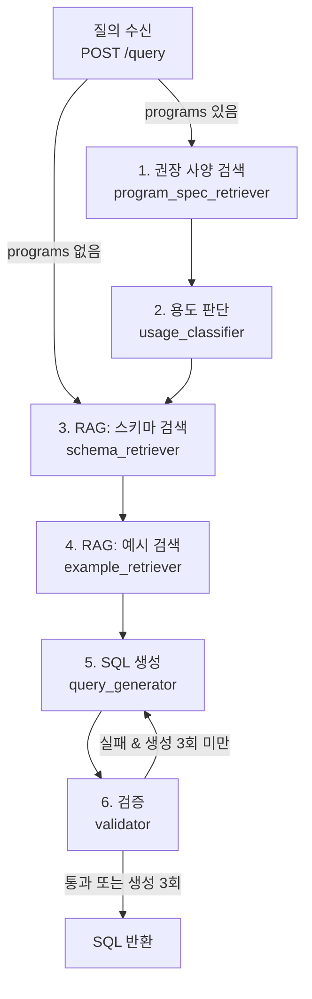

# NL2SQL 동작 흐름

nl2sql 서비스가 자연어 질의를 받아 SQL을 돌려주기까지의 과정을 정리한 문서다.

## 흐름도


```mermaid
flowchart TD
    Q["질의 수신<br/>POST /query"] -- "programs 있음" --> P["1. 권장 사양 검색<br/>program_spec_retriever"]
    Q -- "programs 없음" --> S["3. RAG: 스키마 검색<br/>schema_retriever"]
    P --> U["2. 용도 판단<br/>usage_classifier"]
    U --> S
    S --> E["4. RAG: 예시 검색<br/>example_retriever"]
    E --> G["5. SQL 생성<br/>query_generator"]
    G --> V["6. 검증<br/>validator"]
    V -- "실패 & 생성 3회 미만" --> G
    V -- "통과 또는 생성 3회" --> R["SQL 반환"]
```

| 단계 | 하는 일 | 사용하는 것 | 결과 (State) |
|---|---|---|---|
| 1. 권장 사양 검색 (선택) | 입력받은 프로그램의 권장 사양 검색 | 벡터 DB | `program_specs` |
| 2. 용도 판단 (선택) | 입력받은 프로그램으로 PC 용도 판단 | LLM | `usage` |
| 3. 스키마 검색 | 질의와 관련된 테이블 스키마 6개 검색 | 벡터 DB | `schema_info` |
| 4. 예시 검색 | 비슷한 질문-SQL 예시 3개 검색 | 벡터 DB | `query_example` |
| 5. SQL 생성 | 1~4의 결과와 질의로 SQL 작성 | LLM | `query`, `retry_count` |
| 6. 검증 | 금지어 검사 + `EXPLAIN` 실행 | MySQL | `error` |

## 0. 질의 수신

[nl2sql/main.py](../nl2sql/main.py)

```json
{
  "question": "VRAM 16GB 이상 MSI 그래픽카드 100만원 이하",
  "programs": ["배그", "포토샵"],
  "budget_min": 1000000,
  "budget_max": 2000000
}
```

| 필드 | 내용 |
|---|---|
| `question` | 자연어 질의. 1자 이상 |
| `programs` | 컴퓨터로 사용할 주요 프로그램 이름 목록. 앞뒤 공백을 제거하고, 빈 문자열은 뺀다 |
| `budget_min` | PC 전체 예산의 최솟값. 0 이상의 원 단위 정수 |
| `budget_max` | PC 전체 예산의 최댓값. 0 이상의 원 단위 정수 |

선택 필드가 없으면 `question`만으로 SQL을 생성한다. 

## 1. 권장 사양 검색 — program_spec_retriever

[nl2sql/src/nodes/program_spec_retriever.py](../nl2sql/src/nodes/program_spec_retriever.py) → `get_program_requirements()`

`programs`가 입력된 경우에만 실행한다. 프로그램별 권장 사양을 찾아 `program_specs`에 저장하고, 찾지 못한 프로그램은 제외한다.

- [program_specs.json](../nl2sql/data/program_specs.json)(프로그램 43개)의 `name`과 `aliases`를 각각 문서로 임베딩하고, 사양은 `metadata`에 저장한다.
- 입력한 프로그램 이름과 가장 가까운 문서의 거리가 `PROGRAM_MATCH_THRESHOLD`(0.075) 이하일 때만 해당 사양을 사용한다.
- 질의에만 프로그램 이름이 있고 `programs`가 없으면 검색하지 않는다.

## 2. 용도 판단 — usage_classifier

[nl2sql/src/nodes/usage_classifier.py](../nl2sql/src/nodes/usage_classifier.py)

`programs`가 입력된 경우에만 실행한다. 프로그램과 권장 사양을 LLM에 넘겨 [budget.py](../nl2sql/tools/budget.py)의 `BUDGET_RATIOS` 후보(게임, 영상 편집, 3D·CAD, 개발, 사무) 중 하나를 골라 `usage`에 저장한다.

- 프로그램이 여러 개면 가장 높은 사양이 필요한 프로그램을 기준으로 고른다.
- `budget_max`가 없으면 부품별 상한을 계산할 수 없으므로 LLM을 호출하지 않고 `usage`를 비워 둔다.
- 후보에 없는 값이 나오면 `usage`를 비워 둔다.

## 3~4. RAG — 스키마·예시 검색

[nl2sql/tools/retriever.py](../nl2sql/tools/retriever.py)

SQL을 만들기 전에 필요한 정보를 벡터 DB에서 찾아 프롬프트에 넣는다.

### 벡터 DB

- **저장소**: ChromaDB (`nl2sql/vectordb/`)
- **임베딩 모델**: `BAAI/bge-m3`

| 컬렉션 | 원본 데이터 | 저장 방식 |
|---|---|---|
| `schema_collection` | [data/schema_docs.json](../nl2sql/data/schema_docs.json) | 테이블·뷰 하나당 문서 하나 (테이블·컬럼 설명 JSON) |
| `fewshot_collection` | [data/few_shot_examples.json](../nl2sql/data/few_shot_examples.json) | 질문을 임베딩하고, SQL은 metadata에 저장 |
| `program_collection` | [data/program_specs.json](../nl2sql/data/program_specs.json) | 프로그램 이름과 별칭을 각각 문서로 임베딩하고, 사양은 metadata에 JSON으로 저장 (1단계에서 사용) |

서버가 시작할 때 `init_vector_db_if_need()`가 세 컬렉션 중 **하나라도 비어 있으면** 세 json 파일을 모두 다시 적재(upsert)한다.

`nl2sql/vectordb/`는 git에 포함하지 않으므로 처음 기동할 때 만들어진다. Docker에서는 compose가 `./nl2sql/vectordb`를 마운트해 다시 시작해도 유지되고, 임베딩 모델은 `hf-cache` 볼륨에 캐시된다.

### 3. 스키마 검색 — schema_retriever

[nl2sql/src/nodes/schema_retriever.py](../nl2sql/src/nodes/schema_retriever.py) → `get_schema()`

질의와 관련된 테이블 스키마 **6개**를 가져와 `schema_info`에 저장한다.

- modules, categories 2개의 스키마 정보는 질의와 상관없이 항상 포함한다. 제품명, 제조사, 가격이 modules에만 있고 LLM이 모든 카테고리 종류를 알게 하기위함이다.
- 나머지 4개는 두 테이블을 제외하고 질의 원문과의 유사도로 검색한다. 뷰(`v_*`)도 검색 대상이다.

| 질의 | 가져오는 테이블 |
|---|---|
| VRAM 16GB 이상 그래픽카드 가격 | categories, modules + graphic_cards, v_gpu_power_compat, rams, cpu_memory_clocks |
| 라이젠5 7500F와 호환되는 메인보드 | categories, modules + cpus, main_boards, v_cpu_board_compat, graphic_cards |
| 배틀그라운드 할건데 150만원 이하로 견적 맞춰줘 | categories, modules + v_build_warnings, warning_rules, build_storages, cpus |


### 4. 예시 검색 — example_retriever

[nl2sql/src/nodes/example_retriever.py](../nl2sql/src/nodes/example_retriever.py) → `get_examples()`

질의와 비슷한 질문 **3개**와 그 SQL을 가져와 `query_example`에 저장한다. 5단계에서 few-shot 예시로 쓴다.

```
Question: VRAM 16GB 이상인 그래픽카드를 가격 낮은 순으로 보여줘
SQL: SELECT ...
```

## 5. SQL 생성 — query_generator

[nl2sql/src/nodes/query_generator.py](../nl2sql/src/nodes/query_generator.py)

LLM([chatmodel.py](../nl2sql/src/chatmodel.py), Groq `openai/gpt-oss-120b`, temperature 0, `max_tokens` 8192)에 다음을 넣어 SQL을 만든다.

- 3단계의 스키마
- 4단계의 예시
- 질의 원문
- 1단계의 권장 사양 (`program_specs`가 있을 때만)
- 입력받은 예산 (`budget_min` 또는 `budget_max`가 있을 때만)
- 부품별 가격 상한 (`usage`와 `budget_max`가 모두 있을 때만)

주요 규칙은 다음과 같다.

- SELECT만 작성한다 (INSERT/UPDATE/DELETE/DROP 금지).
- 스키마에 없는 테이블·컬럼은 쓰지 않는다. 스키마 정보가 부족하면 예시를 참고해 작성한다.
- 부품 조회는 항상 `modules`를 조인하고, 부품 목록 조회에는 `modules`의 모든 컬럼을 SELECT에 포함한다.
- 개수 제한이 있는 질의에만 `LIMIT`을 쓴다.
- 가격 상한이 없으면 권장 사양을 만족하는 부품 중 가격이 낮은 순으로 고른다.
- `performance_score`는 같은 카테고리 안에서만 비교한다.
- 예산은 PC 전체 예산으로 보고 부품 목록 조회에만 적용한다. `budget_min`은 가격 조건으로 쓰지 않고, 질의 원문에 가격 조건이 있으면 원문을 따른다.

출력은 `{"sql": "...", "error": "..."}` 형식의 JSON이다. 노드는 `sql`만 `query`에 저장하고 LLM이 적은 `error`는 쓰지 않는다. 따라서 LLM이 SQL을 만들지 못하면 빈 쿼리가 되고, 6단계에서 "쿼리가 생성되지 않았습니다." 오류로 처리된다.

### 예산 상한

| 조건 | 적용하는 상한 |
|---|---|
| `usage`와 `budget_max`가 모두 있음 | 코드가 계산한 부품별 상한 (아래 참고). 상한 목록에 없는 부품은 `budget_max` |
| 그 외 `budget_max`만 있음 | 부품 합계가 `budget_max`를 넘지 않도록 **LLM이 직접** 부품별 상한을 나눈다 |
| `budget_max`가 없음 | 가격 상한 없음 |

부품별 상한은 [budget.py](../nl2sql/tools/budget.py)의 `format_part_budgets()`가 `budget_max × 용도별 비율`로 계산해 프롬프트에 넣는다. 비율은 `BUDGET_RATIOS`에서 관리한다. 계산한 상한이 DB의 카테고리별 최저가(`CATEGORY_MIN_PRICES`)보다 낮으면 최저가를 상한으로 쓴다. 상한 때문에 조회 결과가 비는 일을 막기 위해서다.

예를 들어 용도가 사무이고 `budget_max`가 1,000,000원이면 다음과 같다. 사무에는 GPU 비율이 없으므로 GPU를 조회하면 `budget_max`를 상한으로 쓴다.


상한은 부품별 후보를 거르는 조건이다. 고른 부품의 합계가 예산 안에 드는지와 부품 간 호환성은 확인하지 않는다.

생성할 때마다 `retry_count`가 1씩 늘어난다. 재시도일 때는 이전 SQL과 오류 내용을 프롬프트에 추가해 고치게 한다.

## 6. 검증 — validator

[nl2sql/src/nodes/validator.py](../nl2sql/src/nodes/validator.py), [nl2sql/tools/db_executor.py](../nl2sql/tools/db_executor.py) → `validate_sql()`

다음 순서로 검사하고, 실패하면 `error`에 사유를 기록한다.

1. 쿼리가 비어 있지 않은지
2. `SELECT` 또는 `WITH`로 시작하는지
3. `INSERT`, `UPDATE`, `DELETE`, `DROP`이 포함되지 않았는지 
4. MySQL에서 `EXPLAIN <SQL>`이 성공하는지 (문법, 테이블·컬럼 존재 여부)

`EXPLAIN`은 실행 계획만 확인하므로 데이터를 읽거나 바꾸지 않는다. MySQL 접속 정보는 Docker에서는 `DB_*`, 로컬에서는 루트 `.env`의 `MYSQL_*` 값을 쓴다.

### 재시도 분기

[nl2sql/src/graph.py](../nl2sql/src/graph.py) `route_after_validation()`

| 조건 | 다음 단계 |
|---|---|
| `error`가 비어 있음 (통과) | 종료 |
| `retry_count`가 3 이상 (`MAX_RETRY`) | 종료 (마지막 `error`를 담아 반환) |
| 그 외 | 5단계로 돌아가 다시 생성 |

## 7. 응답

```json
{
  "query": "SELECT m.module_id, ... FROM modules m JOIN graphic_cards g ON ... WHERE ...",
  "error": "",
  "retry_count": 1
}
```

`error`가 빈 문자열이면 성공이다. `retry_count`는 재시도 횟수가 아니라 SQL을 생성한 횟수(1~3)다. nl2sql은 SQL을 만들기만 하고, 실제 조회는 이 SQL을 받은 백엔드가 한다.

## 알아둘 점

- **LLM 호출 횟수**: 질의 하나당 SQL 생성 1~3번이다. `programs`와 `budget_max`가 모두 있으면 용도 판단 1번이 더해져 2~4번이다.
- **MySQL 필요**: 검증에서 `EXPLAIN`을 실행하므로 MySQL이 꺼져 있으면 모든 질의가 SQL을 3번 생성한 뒤 실패한다.
- **실행 위치**: `./vectordb`, `data/*.json`을 상대 경로로 열기 때문에 로컬에서는 `nl2sql/` 폴더에서 실행해야 한다. Docker에서는 작업 폴더가 `/app`이라 따로 신경 쓰지 않아도 된다.
- **필수 테이블 필터**: `modules`, `categories`는 문서 안의 `"table": "modules"` 문자열로 찾는다. 스키마 문서를 적재하는 `json.dumps` 형식을 바꾸면 필터가 동작하지 않을 수 있다.
- **금지어 검사**: 대소문자를 구분하는 부분 문자열 비교라서 소문자 `delete` 등은 걸리지 않는다. 그래도 `EXPLAIN`은 문장을 실제로 실행하지 않으므로 검증 단계에서 데이터가 바뀌지는 않는다.
