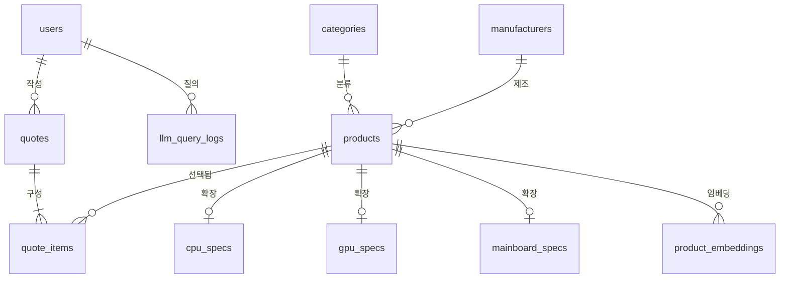

# 01. 유저 스키마 설계

## 배경

컴퓨터 부품 판매 사이트를 컨셉으로 하지만, 실제 구매(결제·배송)로 이어지는 로직은
구현하지 않는다. 이 프로젝트의 핵심은 **LLM + LangChain 기반 자연어 견적 질의**이고,
DB 설계도 그 핵심 로직을 뒷받침하는 방향으로 간다.

따라서 유저는 커머스의 "고객"이 아니라 **행동의 주체를 구분하기 위한 식별자**다.
"누가 이 견적을 만들었는가", "누가 이 질의를 던졌는가"를 구분할 수 있으면 충분하다.

이번 단계에서는 **유저 스키마만 실제로 구현**하고, 나머지는 계획만 세운다.

---

## 1. 환경 확정

| 항목 | 값 |
| --- | --- |
| DBMS | MySQL 8.0 |
| 데이터베이스 이름 | `data_base_design` |
| 문자셋 / 콜레이션 | `utf8mb4` / `utf8mb4_0900_ai_ci` (MySQL 8 기본값) |
| 스토리지 엔진 | InnoDB (MySQL 8 기본값. FK·트랜잭션에 필요) |
| 스키마 버전 관리 | Flyway |

### Flyway 운영 규칙

- 마이그레이션 위치: [backend/src/main/resources/db/migration](../../backend/src/main/resources/db/migration)
- 파일명: `V{버전}__{설명}.sql` (예: `V1__create_users.sql`)
- **이미 적용된 마이그레이션 파일은 절대 수정하지 않는다.** 스키마를 바꿔야 하면
  `V2__...` 를 새로 추가한다. 수정하면 체크섬이 달라져 다른 사람 DB에서 실패한다.
- JPA는 `ddl-auto: validate`. **DDL의 소유자는 Flyway 하나뿐**이고, JPA는 엔티티 매핑이
  실제 스키마와 어긋나지 않는지 검증만 한다. 둘 다 스키마를 만들면 반드시 어긋난다.
- 적용 이력은 Flyway가 `flyway_schema_history` 테이블에 남긴다.

### 접속 정보 분리

DB 계정/비밀번호는 `application-local.yml` 에만 두고 `.gitignore` 로 제외한다.
`application.yml` 에는 자격증명을 두지 않는다. 기본 활성 프로파일은 `local`.

---

## 2. 설계 원칙

| 원칙 | 내용 |
| --- | --- |
| 최소 속성 | 인증에 꼭 필요한 것 외에는 두지 않는다. |
| 인증 체계 없음 | 토큰·세션을 두지 않는다. 로그인은 아이디/비밀번호 확인이 전부. |
| 평문 비밀번호 금지 | BCrypt 해시만 저장한다. |
| 대리키 사용 | `login_id`는 사람이 보는 값, FK로 쓰는 것은 `user_id`(BIGINT). |

### 왜 `login_id`가 아니라 `user_id`를 PK로 두는가

`login_id`도 UNIQUE라 후보키가 되지만, PK로 쓰면

- 이후 `quotes`, `llm_query_logs` 등 모든 자식 테이블이 `VARCHAR(30)`을 FK로 들고 가야 하고,
- 아이디 변경 정책이 생기는 순간 연쇄 UPDATE가 발생한다.

BIGINT 대리키를 PK로 두고 `login_id`에는 UNIQUE 제약만 거는 쪽이 안전하다.

### 뺀 컬럼과 그 이유

| 뺀 컬럼 | 이유 |
| --- | --- |
| `email` | 비밀번호 찾기·알림이 범위 밖이라 쓰이는 곳이 없다. |
| `role` | 관리자 기능이 없다. 필요해지면 `V2`로 추가한다. |
| `status` | 탈퇴·정지 기능이 없다. |
| `last_login_at` | 통계 화면이 없다. |
| `updated_at` | 변경되는 속성이 사실상 없다. |

지금 안 쓰는 컬럼을 미리 만들어 두면 NULL만 쌓이고 의미도 흐려진다.
필요해지는 시점에 마이그레이션으로 붙이는 쪽이 낫다.

---

## 3. 테이블 정의: `users`

| 컬럼 | 타입 | 제약 | 설명 |
| --- | --- | --- | --- |
| `user_id` | BIGINT | PK, AUTO_INCREMENT | 대리키. 모든 FK의 참조 대상 |
| `login_id` | VARCHAR(30) | NOT NULL, UNIQUE | 로그인 식별자. 영문/숫자/밑줄 4~30자 |
| `password` | VARCHAR(100) | NOT NULL | BCrypt 해시(60자). 여유분 포함 |
| `nickname` | VARCHAR(20) | NOT NULL | 화면 표시용. 2~20자 |
| `created_at` | DATETIME(6) | NOT NULL | 가입 시각. JPA Auditing이 채운다 |

`DATETIME(6)`인 이유: Hibernate가 `LocalDateTime`을 마이크로초 정밀도로 매핑한다.
`DATETIME`으로 두면 `ddl-auto: validate`가 타입 불일치로 막힌다.

### 정규화 검토

`users`는 PK `user_id`에 모든 비키 속성이 완전 함수 종속이고, 이행 종속이 없다.
복합키가 없으므로 2NF는 자동 충족, `login_id → nickname` 같은 비키 간 결정 관계도 없어
**3NF를 만족**한다. 후보키 `{user_id}`, `{login_id}` 각각이 유일 결정자이므로 **BCNF**도 만족한다.

### DDL

[V1__create_users.sql](../../backend/src/main/resources/db/migration/V1__create_users.sql)

```sql
CREATE TABLE users
(
    user_id    BIGINT       NOT NULL AUTO_INCREMENT,
    login_id   VARCHAR(30)  NOT NULL,
    password   VARCHAR(100) NOT NULL,
    nickname   VARCHAR(20)  NOT NULL,
    created_at DATETIME(6)  NOT NULL,
    PRIMARY KEY (user_id),
    UNIQUE KEY uk_users_login_id (login_id)
) DEFAULT CHARSET = utf8mb4;
```

`ENGINE`과 `COLLATE`를 적지 않았지만, MySQL 8은 기본 엔진이 InnoDB이고
`utf8mb4`의 기본 콜레이션이 `utf8mb4_0900_ai_ci`라 실제로 만들어지는 테이블은

```
) ENGINE=InnoDB DEFAULT CHARSET=utf8mb4 COLLATE=utf8mb4_0900_ai_ci
```

가 된다. 명시해도 결과는 같다.

---

## 4. 구현 범위

구현된 것은 **회원가입 / 로그인** 뿐이다.

| 메서드 | 경로 | 설명 |
| --- | --- | --- |
| POST | `/api/auth/signup` | 회원가입 |
| POST | `/api/auth/login` | 아이디/비밀번호 확인 후 유저 정보 반환 |
| GET | `/api/auth/check-login-id?loginId=` | 아이디 중복 확인 |
| GET | `/api/users/{userId}` | 유저 조회 |

### 인증 체계를 두지 않는 이유

이 프로젝트가 보여주려는 것은 **자연어 질의로 견적을 뽑는 과정**이지 인증이 아니다.
JWT 발급·검증, 필터체인, 토큰 만료 처리는 전부 그 목적과 무관한 무게다.

그래서 로그인은 "이 아이디와 비밀번호가 맞는가"를 확인하고 유저 정보를 돌려주는 것으로 끝난다.
클라이언트는 거기서 받은 `userId` 를 이후 요청(견적 생성, 질의 로그)에 그대로 실어 보낸다.
유저가 존재하는 이유 자체가 **행동 주체를 구분하는 것**이라, 이 수준이면 목적을 채운다.

다만 비밀번호는 BCrypt로 해싱해서 넣는다. `spring-security-crypto` 한 개만 쓰고
자동설정도 필터도 붙지 않아 무게가 늘지 않는데, 평문 비밀번호가 들어간 테이블을
과제로 제출하는 것은 피하는 편이 낫기 때문이다.

로그인 실패 시 "아이디 없음"과 "비밀번호 틀림"을 같은 에러(`LOGIN_FAILED`)로 응답한다.
아이디 존재 여부가 새어 나가지 않게 하기 위함이다.

이 구조에서는 **누구나 아무 `userId` 나 보낼 수 있다.** 실제 서비스라면 성립하지 않지만,
시연이 목적이고 구매·결제가 없어 보호할 자산이 없으므로 의도적으로 감수한다.

---

## 5. 이후 스키마 계획 (설계만, 미구현)

### 5-1. 전체 ERD 방향



### 5-2. 필수 부품 테이블만 먼저

부품 카테고리는 **PC 한 대를 조립하는 데 반드시 필요한 것**만 1차 대상으로 한다.

| 카테고리 | 1차 포함 | 이유 |
| --- | --- | --- |
| CPU | O | 없으면 PC가 성립하지 않음 |
| 메인보드 | O | 호환성 판정의 중심(소켓/폼팩터/칩셋) |
| 메모리(RAM) | O | 규격(DDR4/DDR5)이 호환성에 직결 |
| 저장장치(SSD/HDD) | O | 필수 |
| 파워(PSU) | O | 정격 용량 계산에 필요 |
| 케이스 | O | 폼팩터 호환 판정에 필요 |
| 그래픽카드(GPU) | O | 견적의 핵심 변수 |
| CPU 쿨러 | △ | 2차. 기본 쿨러 전제로 미룰 수 있음 |
| 모니터·주변기기 | X | 조립 범위 밖 |

### 5-3. 공통 + 서브타입 구조

부품은 카테고리마다 스펙 속성이 완전히 다르다(CPU는 코어 수, RAM은 용량·클럭).
전부 한 테이블에 넣으면 NULL 컬럼이 대량으로 생겨 정규화가 깨진다.
따라서 **공통 속성 테이블 + 카테고리별 스펙 테이블(1:1)** 구조로 간다.

```
products (공통: 이름, 카테고리, 제조사, 가격, 재고, 이미지, 출시일)
   └─ cpu_specs        (product_id PK/FK, socket, cores, threads, base_clock, tdp, ...)
   └─ gpu_specs        (product_id PK/FK, vram_gb, tdp, length_mm, power_connector, ...)
   └─ mainboard_specs  (product_id PK/FK, socket, chipset, form_factor, memory_type, ...)
   └─ memory_specs     (product_id PK/FK, memory_type, capacity_gb, speed_mhz, ...)
   └─ storage_specs    (product_id PK/FK, storage_type, interface, capacity_gb, ...)
   └─ psu_specs        (product_id PK/FK, wattage, efficiency_rating, form_factor, ...)
   └─ case_specs       (product_id PK/FK, form_factors, max_gpu_length_mm, ...)
```

각 스펙 테이블은 `product_id`를 PK이자 FK로 쓴다(식별 관계). 1:1이 보장된다.

### 5-4. 호환성 판정

자연어 견적의 핵심은 "이 조합이 실제로 조립 가능한가"다. 이건 **컬럼 값 비교**로 풀린다.

| 판정 | 비교 대상 |
| --- | --- |
| CPU ↔ 메인보드 | `cpu_specs.socket = mainboard_specs.socket` |
| RAM ↔ 메인보드 | `memory_specs.memory_type = mainboard_specs.memory_type` |
| 메인보드 ↔ 케이스 | `mainboard_specs.form_factor ∈ case_specs.form_factors` |
| GPU ↔ 케이스 | `gpu_specs.length_mm <= case_specs.max_gpu_length_mm` |
| 파워 용량 | `SUM(tdp) * 안전계수 <= psu_specs.wattage` |

소켓·폼팩터·메모리 규격 같은 값은 오타 하나로 판정이 깨지므로
`sockets`, `form_factors`, `memory_types` **코드 테이블로 빼고 FK로 묶는다.**

### 5-5. 견적

```
quotes      (quote_id PK, user_id FK, title, purpose, budget, total_price, created_at)
quote_items (quote_item_id PK, quote_id FK, product_id FK, quantity, price_snapshot)
```

- `quotes.user_id` → **여기서 유저가 필요한 이유.** 견적의 소유자를 구분한다.
- `price_snapshot`: 부품 가격은 변하므로, 견적 생성 시점 가격을 복제해 둔다.
  정규화 원칙상 중복이지만 **이력 보존이 목적인 의도된 반정규화**다.
- `(quote_id, product_id)` UNIQUE — 같은 견적에 같은 부품이 두 줄로 들어가지 않게 한다.

### 5-6. LLM / LangChain 연동

```
llm_query_logs     (log_id PK, user_id FK, raw_query, parsed_condition JSON,
                    generated_quote_id FK NULL, model_name, token_usage, latency_ms, created_at)
product_embeddings (embedding_id PK, product_id FK, source_text, embedding, model_name)
```

- `llm_query_logs`: "게임용 150만원대로 맞춰줘" 같은 원문과, LangChain이 뽑아낸
  구조화 조건(JSON)을 함께 남긴다. 파싱 품질 개선과 평가의 근거가 된다.
  MySQL 8의 `JSON` 타입을 쓰면 되고, 자주 거르는 키는 생성 컬럼 + 인덱스로 뽑아낼 수 있다.
- `product_embeddings`: **MySQL 8.0에는 네이티브 `VECTOR` 타입과 벡터 인덱스가 없다.**
  (`VECTOR`는 MySQL 9.0부터.) 따라서 임베딩은 `JSON` 또는 `BLOB`으로 보관하고
  유사도 계산은 애플리케이션/LangChain 벡터 스토어 쪽에서 한다.
  이 테이블은 **부품 ↔ 임베딩 매핑과 재생성 이력**을 갖는 용도다.
  부품 수가 수천 건 규모면 이 방식으로 충분하다.

### 5-7. 다음 문서 순서

| 번호 | 문서 | 대응 마이그레이션 |
| --- | --- | --- |
| 01 | 유저 스키마 설계 (이 문서) | `V1__create_users.sql` |
| 02 | 부품 공통/카테고리 스키마 설계 | `V2__...` |
| 03 | 호환성 코드 테이블 및 판정 규칙 | `V3__...` |
| 04 | 견적 스키마 설계 | `V4__...` |
| 05 | LLM 질의 로그 및 임베딩 스키마 설계 | `V5__...` |

---

## 6. 남은 결정 사항

- **CPU 쿨러를 1차 범위에 넣을지**.
- **재고(stock)를 `products` 컬럼으로 둘지 별도 테이블로 뺄지**: 구매 로직이 없으므로
  단순 컬럼으로 충분해 보이나, 입출고 이력을 보여주려면 분리가 필요하다.
